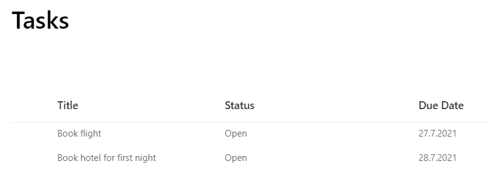
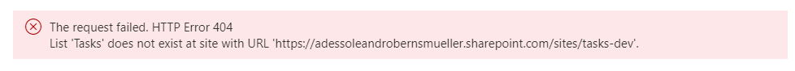

# SPFx Tasks

## Summary

A SPFx Tasks web part to display tasks from a custom list.



## Features

* React function components
* React hooks
* React context API

* [Azure DevOps with SharePoint](https://github.com/leberns/spfx-tasks/wiki/Azure-DevOps-with-SharePoint)

Example of a successful release:  


* [ErrorViewer](./src/errors/errorViewer/ErrorViewer.tsx) component to display PnPJs errors nicely

Response error example:  
```JSON
{
    "odata.error": {
        "code": "-1, System.ArgumentException",
        "message": {
            "lang": "en-US",
            "value": "List 'Tasks' does not exist at site with URL 'https://YOUR-TENANT.sharepoint.com/sites/tasks-dev'."
        }
    }
}
```

ErrorViewer component output:


* Entity mapping - map internal field names -> friendly property names and metadata, ex.: lbItemStatus -> status, choice field. See [entities/](./src/entities/), [mappers/](./src/mappers/)

## SharePoint Framework Version

1.12.1

## Version history

Version|Date|Comments
-------|----|--------
0.1|12.06.2021|Initial release - display items

## Disclaimer

**THIS CODE IS PROVIDED *AS IS* WITHOUT WARRANTY OF ANY KIND, EITHER EXPRESS OR IMPLIED, INCLUDING ANY IMPLIED WARRANTIES OF FITNESS FOR A PARTICULAR PURPOSE, MERCHANTABILITY, OR NON-INFRINGEMENT.**

## Minimal Path to Awesome

- Clone this repository
- Ensure that you are at the solution folder
- Update config/serve.json with your "pageUrl" 
- In the command-line run:
  - **npm install**
  - **gulp trust-dev-cert**
  - **gulp serve**

## References

- [How to use React Context effectively](https://kentcdodds.com/blog/how-to-use-react-context-effectively)
- [Application State Management with React](https://kentcdodds.com/blog/application-state-management-with-react)
- [The modern guide to React state patterns](https://blog.logrocket.com/modern-guide-react-state-patterns/)
